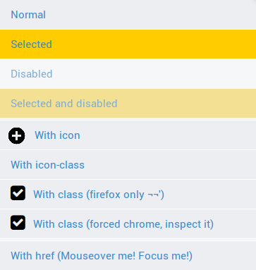

<sr-list>
=========

An web component list-group abstraction with pre-defined handling methods

About
------
At some point you've needed [a simple vertical menu](http://getbootstrap.com/components/#list-group) or [list step by step](http://www.polymer-project.org/#learn).
When it is necessary in a webapp, we sometimes add, remove, disable, dynamically update these items, and do something minimally serviceable,
uses a time abstracting and creating code.

The idea `<sr-list>` just give the basics of what we need to have some time without restricting its customization.

Image example
--------------


Demo
------
[Online demo in here!](http://donnot-iberia.codio.io/index.html)

Support
----------
Lastest Firefox and Chrome (Impementing)

## Custom Element Framework Compatibility

- [ ] [Polymer](http://www.polymer-project.org/)
- [ ] [X-Tags](http://www.x-tags.org/)
- [x] [Angular.JS](https://angularjs.org/)
- [ ] [React](http://facebook.github.io/react/)
- [ ] [Ember](http://emberjs.com/)

Use Suggestions
---------------
As the technology of web components is recent, it is recommended a controllable environment, 
such as [node-webkit](https://github.com/rogerwang/node-webkit).

How to use
----------

### Overview
  ```html
<h2> As list-group </h2>
<aside role="complementary">

	<sr-list type="vertical">
        <sr-item>Normal</sr-item>
        <sr-item selected>Selected</sr-item>
        <sr-item disabled>Disabled</sr-item>
        <sr-item separator></sr-item>
        <sr-item icon="icon.png">With icon</sr-item>
        <sr-item icon-class="fa-plus">With icon-class</sr-item>
        <sr-item separator></sr-item>
		<sr-item href="index.html">With href (please, mouseover me)</sr-item>
	</sr-list>

</aside>
  ```


#### Attributes
__Note__: strikethrough -> not implemented

##### sr-list
Attribute     | Options                  | Default       | Description
---           | ---                      | ---           | ---
`disable`     |                          |               | Disable it

##### sr-item
Attribute     | Options             | Default                    | Description
---           | ---                 | ---                        | ---
`icon`        | image address                                    |         | Add a icon image in left of the text
`icon-class`  | css's class                                      |         | Class of image src. [Like as Font Awesome](http://fortawesome.github.io/Font-Awesome/)
`disable`     |                                                  |         | Disable it
`selected`    |                                                  |         | Select it
`href`        | `javascript:function()`, `an_address.html`       |         | As `a[type=href]` attribute. Use to redirect page or add javascript methods
`selected`    |                                                  |         | Select it
`separator`   |                                                  |         | Separator divider (only works on `sr-list[vertical]`)

#### Handling
##### sr-list
Method              | Description                               | Return / Param               | Param description
---                 | ---                                       | ---                          | ---
`add(label, attributes, position)` | Add a sr-item in the menu  | return `<sr-item>` generated |
                    | `label`                                   | `String`                     | Item label
                    | `attributes`                              | `Object`                     | `{"attribute-name": "value"}`
                    | `position`                                | `Integer`                    | Position where item will be added
                    | `position`                                | `undefined`                  | Last position
`get(index)`        | Return the item with this 'index'         | return `<sr-item>`           |
                    | `index`                                   | `Integer`                    | Index of item
`getItems()`        | Return all the children nodes             | return `[<sr-item>, ...]`    |
`remove(index)`     | Remove and return item in the 'index' position | return `<sr-item>`      |
                    | `index`                                   | `Integer`                    | Index position. -1 for last
`getSelected()`     | Return the first element with state seleted | return `<sr-item>`         | 
`getSelectedAll()`  | Return all the elements with state seleted  | return `[<sr-item>, ...]`  | 
`disable(state)`    | Change state to disabled/enabled          |                              | 
                    | `state`                                   | `undefined`                  | Change state to disabled     
                    | `state`                                   | `boolean`                    | Change state to disabled/enabled


##### sr-item
Method               | Description                                         | Return / Param | Param description
---                  | ---                                                 | ---            | ---
`isSelected`         | This item is selected?                              | return boolean | 
`select(state)`      | Change state to select/unselect                     |                |
                     | `state`                                             | `undefined`    | Change state to selected
                     | `state`                                             | `boolean`      | Change state to boolean value
`isDisabled()`       | This item is disables?                              | return boolean | 
`disable(state)`     | Change state to disabled/enabled                    |                |
                     | `state`                                             | `undefined`    | Change state to disabled
                     | `state`                                             | `boolean`      | Change state to boolean value
`getIndex()`         | Return the index of the element or -1 if not found  |                |


#### Customing design
You can edit style! Try:

```css
sr-list {
	background-color:
}
sr-item {
	background-color:
}
sr-item[selected] {
	background-color:
}
sr-item[selected]:hover {
	background-color:
}
sr-item[disabled] {
	background-color:
}
sr-item[selected][disabled] {
	background-color:
}
sr-item:hover {
	background-color:
}

/* Buggy */
sr-item:focus {
	background-color:
}
sr-item:active {
	background-color:
}
```